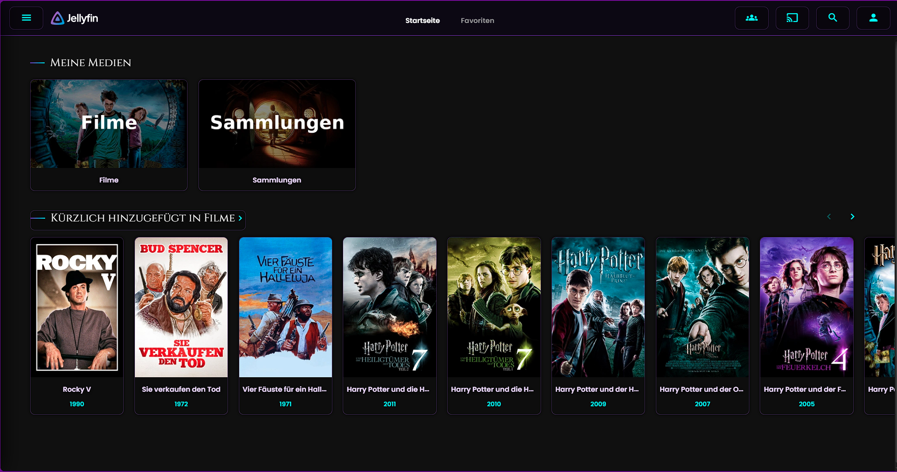
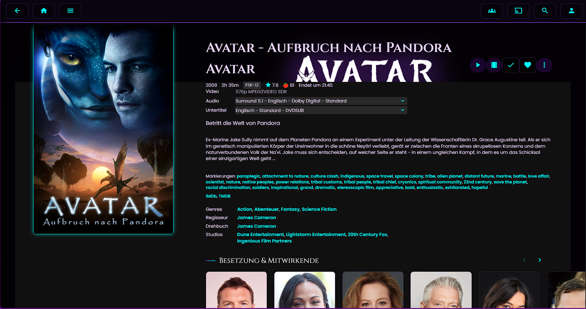
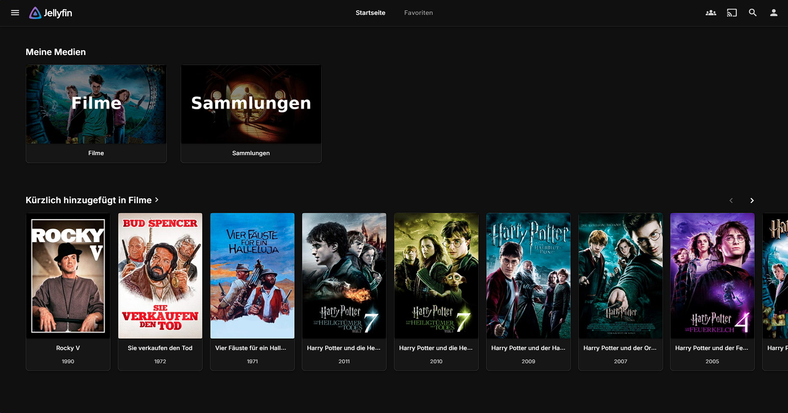
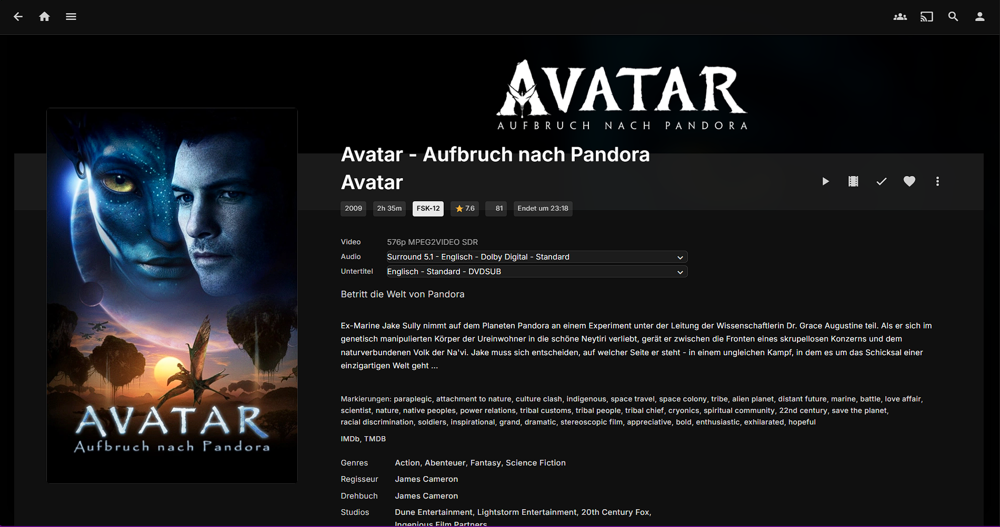

# Jellyfin Skins - Custom CSS themes to enhance your jellyfin experience

**Attention:** The skins are automatically updated if the import url is used! In case you don't want an update please copy the css code directly into Jellyfin. 
-

## Skins
- ***mystic-fantasy | @import url('https://b3crazy.github.io/Jellyfin-Skins/docs/mystic-fantasy.css');***
 

- ***standart-lecturate | @import url('https://b3crazy.github.io/Jellyfin-Skins/standart-lecturate.css');***
 

# Troubleshooting
**Possible solutions if the apperance doesn't change:**
1. empty cache (Strg + F5 / STRG + Shift + R)
2. check and reenter the CSS and save the change